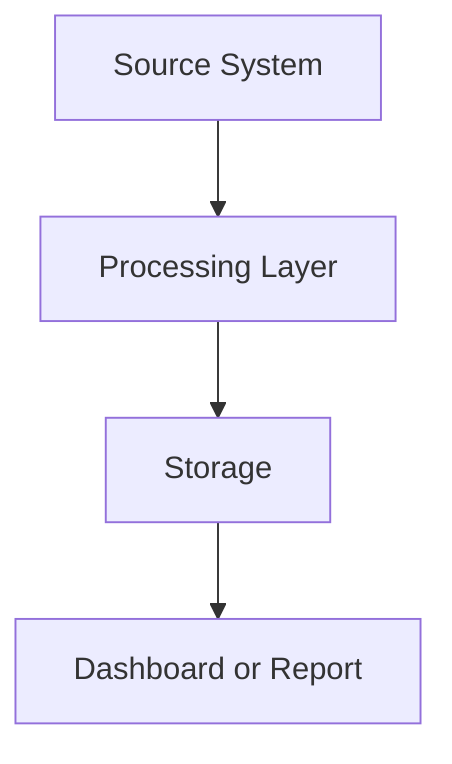

# Mission Context

## Watch Role

Mission Context.

This folder stores durable background information that helps humans and AI tools understand the project.

It is not the current mission order, not the verified truth ledger, not raw evidence, and not final output.

## Purpose

Use `01_context/` to preserve stable background context such as:

```text
domain notes
business process descriptions
system summaries
vocabulary
acronyms
field meanings
known naming conventions
topology notes
Mermaid diagrams
dependency maps
data-flow notes
```

## Files

| File | Purpose |
|---|---|
| `CONTEXT_INDEX.md` | Catalog of context files and their status. |
| `DOMAIN_NOTES.md` | Business/domain background and operating assumptions. |
| `VOCABULARY.md` | Terms, acronyms, field meanings, and naming conventions. |
| `SYSTEM_OVERVIEW.md` | High-level system, service, or process description. |
| `TOPOLOGY.md` | Architecture, dependency, flow, or topology notes and diagrams. |

## File Boundaries

### Root Control Files

Use root files for active mission control:

```text
CURRENT_MISSION.md
PROJECT_STATE.md
AI_CONTEXT.md
AI_HANDOFF.md
TOOL_NOTES.md
```

Do not duplicate root control content here.

### `01_context/`

Use this folder for durable supporting background.

Context can be useful even when the current mission changes.

### `02_evidence/`

Use `02_evidence/` for raw proof, samples, logs, screenshots, exports, and registered evidence.

Do not store raw evidence in `01_context/`.

### `05_reports/` and `06_outputs/`

Use reports and outputs folders for produced deliverables.

Do not store final deliverables in `01_context/`.

## Context Status Values

Use one of:

```text
draft
active
stale
deprecated
superseded
unknown
```

## Update Authority

Humans may update files in this folder directly.

AI tools may update files in this folder only when explicitly instructed.

If AI-generated context is based on assumptions rather than evidence, label it clearly as an assumption.

Do not let AI tools promote assumptions to facts without human confirmation or evidence-backed support.

## Context Update Trigger

During project work, humans and AI tools should check whether new durable background context has been discovered.

A context update may be needed when work reveals:

```text
new domain knowledge
new business rules
new vocabulary or acronyms
new system behavior
new service dependencies
new topology or data-flow details
new external documentation references
stable tool or platform constraints
```

AI tools must not silently edit context files unless explicitly authorized.

When an AI tool detects possible durable context, it should propose:

```text
Context Update Check:
- Proposed target file:
- Proposed summary:
- Source / reference:
- Reason this is durable context:
- Validation needed: Yes/No/Unknown
```

This check may happen during initialization, evidence review, query review, dashboard review, notebook review, handoff, closeout, or analysis.

The human must approve before the context file is updated.

## Evidence Boundary

Context files may summarize evidence only when they reference the evidence location.

Example:

```text
See 02_evidence/EVIDENCE_INDEX.md entry E-0001.
```

Do not paste large raw evidence into context files.

## Diagram Guidance

Mermaid diagrams are preferred for text-native diagrams.

Example:



Use diagrams for:

```text
system topology
data flow
service dependencies
process flow
handoff flow
observability coverage
```

## Safety Rules

Do not store secrets, credentials, API keys, tokens, private keys, certificates, or restricted data in this folder.

Do not paste raw logs or large data extracts into context files.

Do not treat context notes as verified evidence.

Do not let old chat memory override `PROJECT_STATE.md`.

When context conflicts with `PROJECT_STATE.md`, treat `PROJECT_STATE.md` as higher authority.

## Last Updated

Local time: `[YYYY-MM-DD HH:MM timezone]`

Updated by: `[Human/ChatGPT/Codex/etc.]`
