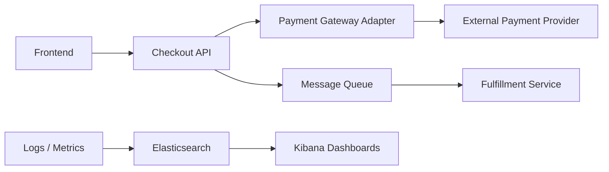

# Topology

## Watch Role

Lines and Boundaries.

This file records durable architecture, dependency, flow, and topology context that helps humans and AI tools understand how major parts of the project environment connect to each other.

It is not evidence. It is not the verified truth ledger.

## Purpose

Use this file to record:

```text
system-to-system relationships
dependency paths
data-flow paths
control-flow paths
environment boundaries
network or service boundaries
handoff points between components
text-native diagrams
```

Do not use this file for raw evidence, raw logs, query results, dashboard findings, notebook outputs, reports, or final conclusions.

Plain meaning:

```text
TOPOLOGY.md = the connection map that shows how important project components relate, depend, and flow into one another.
```

Working allegory:

```text
TOPOLOGY.md = roads and lines between places
SYSTEM_OVERVIEW.md = watchtower layout
DOMAIN_NOTES.md = terrain map
VOCABULARY.md = phrasebook
PROJECT_STATE.md = current intelligence report
```

This file explains how the major parts connect.

## What Belongs Here

Examples of topology notes include:

- service-to-service dependency paths
- source-to-storage-to-dashboard data flows
- boundaries between internal and external systems
- network or environment separations such as production, staging, or vendor edges
- pipeline stages that hand data or events from one component to another
- Mermaid diagrams showing how major components connect

These are examples of the kinds of durable structural connection notes that belong here.

They are illustrative guidance only.

Do not treat example content as actual project facts unless a copied project instance is later populated with confirmed topology.

## What Does Not Belong Here

Do not store:

- raw logs
- screenshots
- query output
- notebook output
- one-time incident timelines
- tool bugs
- temporary theories
- full external documentation
- credentials
- final report text
- current mission state
- verified project truth that belongs in `PROJECT_STATE.md`
- low-level packet traces or implementation details that belong in evidence

## Topology Summary

```text
The fictional checkout service has a customer-facing checkout path, a downstream fulfillment path, and an observability path through Elasticsearch and Kibana.
```

## Major Connections

| Source | Destination | Relationship / Flow | Source / Reference | Status |
|---|---|---|---|---|
| `Frontend` | `Checkout API` | `Customer checkout requests flow into application handling.` | `Human-supplied dry run scenario` | `active` |
| `Checkout API` | `Payment Gateway Adapter` | `Checkout requests move into payment authorization handling.` | `Human-supplied dry run scenario` | `active` |
| `Payment Gateway Adapter` | `External Payment Provider` | `Authorization requests leave the controlled environment.` | `Human-supplied dry run scenario` | `active` |
| `Checkout API` | `Message Queue` | `Application emits downstream checkout-related events.` | `Human-supplied dry run scenario` | `active` |
| `Message Queue` | `Fulfillment Service` | `Queued events continue into fulfillment processing.` | `Human-supplied dry run scenario` | `active` |
| `Logs/Metrics` | `Elasticsearch` | `Observability signals are expected to land in the search and storage layer.` | `Human-supplied dry run scenario` | `active` |
| `Elasticsearch` | `Kibana Dashboards` | `Dashboards are expected to read from the observability store.` | `Human-supplied dry run scenario` | `active` |

## Dependency Paths

| Dependency Path | Description | Source / Reference | Status | Notes |
|---|---|---|---|---|
| `Frontend -> Checkout API -> Payment Gateway Adapter -> External Payment Provider` | `Primary payment authorization dependency path.` | `Human-supplied dry run scenario` | `active` | `Critical path for checkout latency interpretation.` |
| `Checkout API -> Message Queue -> Fulfillment Service` | `Downstream event propagation path.` | `Human-supplied dry run scenario` | `active` | `Not the primary latency focus of this initialization.` |
| `Logs/Metrics -> Elasticsearch -> Kibana Dashboards` | `Observability dependency path.` | `Human-supplied dry run scenario` | `active` | `Used later for investigation and visualization.` |

## Data or Event Flows

| Flow | Description | Trigger / Direction | Source / Reference | Status |
|---|---|---|---|---|
| `Payment authorization flow` | `Checkout moves toward external authorization through the application path.` | `Synchronous request path` | `Human-supplied dry run scenario` | `active` |
| `Fulfillment event flow` | `Checkout API emits events toward fulfillment processing.` | `Downstream event path` | `Human-supplied dry run scenario` | `active` |
| `Observability flow` | `Logs and metrics are expected to support later dashboards and analysis.` | `Operational signal path` | `Human-supplied dry run scenario` | `active` |

## Environment or Boundary Notes

| Boundary | Meaning | Source / Reference | Status | Notes |
|---|---|---|---|---|
| `Internal to external payment edge` | `Boundary between controlled application components and the external provider.` | `Human-supplied dry run scenario` | `active` | `Potential source of degraded latency or failures.` |
| `Application to observability edge` | `Boundary between service execution and the observability stack.` | `Human-supplied dry run scenario` | `active` | `Observability is expected to observe, not execute, checkout behavior.` |

## Diagram Space

Use Mermaid diagrams when text-only structure is clearer than tables.

Example:



Use diagrams for:

```text
system topology
dependency maps
data flow
service boundaries
environment boundaries
handoff points
```

## Out-of-Scope Topology Notes

```text
Low-level network paths, deployment zones, and vendor-internal payment topology are intentionally not described by this dry run.
```

## Context Update Trigger

During project work, humans and AI tools should check whether durable topology context has been discovered.

A topology update may be needed when work reveals:

```text
new dependency paths
new service or system connections
new data or control-flow understanding
new environment boundaries
new integration edges
new handoff points between major components
stable architectural connection rules
```

AI tools must not silently edit this file unless explicitly authorized.

When an AI tool detects possible durable topology context, it should propose:

```text
Context Update Check:
- Proposed target file: 01_context/TOPOLOGY.md
- Proposed summary:
- Source / reference:
- Reason this is durable topology context:
- Validation needed: Yes/No/Unknown
```

The human must approve before the context file is updated.

## Update Rules

Keep entries concise and durable.

Prefer stable connection structure over one-time operational anomalies.

Use source references when possible.

Do not promote assumptions to facts without human confirmation or evidence-backed support.

When topology context changes, update the relevant row status and add a note.

When topology context conflicts with `PROJECT_STATE.md`, treat `PROJECT_STATE.md` as higher authority.

If durable topology context is discovered during initialization, evidence review, query review, dashboard review, notebook review, handoff, closeout, or analysis, propose a `TOPOLOGY.md` update instead of silently editing this file.

`prompts/mission-init.prompt.md` may initialize or update this file during initialization only when durable context is supplied by explicit human statements, supplied project files, supplied architecture notes, supplied evidence summaries, or human-confirmed facts.

`prompts/mission-init.prompt.md` must not write guessed domain facts, AI memory, generic examples as project facts, unverified assumptions as confirmed truth, raw evidence, or large pasted documentation.

If source strength is weak, the item must be marked as an assumption, open question, or proposed context update.

Other prompts may propose `TOPOLOGY.md` updates unless explicitly authorized.

## Cross-References

Relevant files:

```text
PROJECT_STATE.md
CURRENT_MISSION.md
AI_CONTEXT.md
01_context/CONTEXT_INDEX.md
01_context/SYSTEM_OVERVIEW.md
01_context/DOMAIN_NOTES.md
02_evidence/EVIDENCE_INDEX.md
03_queries/QUERY_REGISTRY.md
04_notebooks/NOTEBOOK_INDEX.md
```

## Safety Rules

Do not store secrets, credentials, API keys, tokens, private keys, certificates, or restricted data in this file.

Do not paste raw logs or large evidence extracts into this file.

Do not treat topology notes as verified evidence unless they cite registered evidence.

## Last Updated

Local time: `2026-06-26 00:33 -06:00 America/Mexico_City`

Updated by: `Codex`
