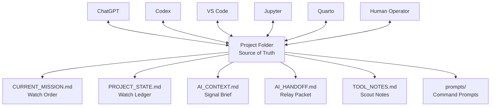
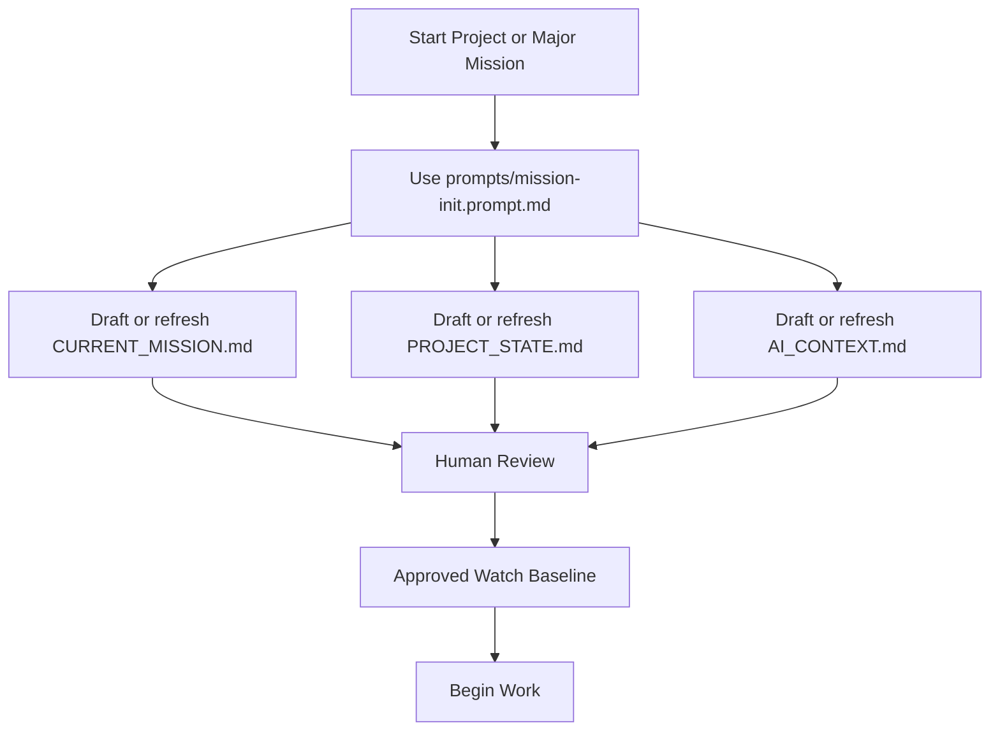
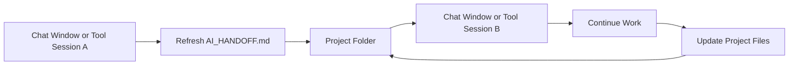

# Tzafa Project Template

## What This Is

This is a reusable local-first project template for AI-assisted observability work.

It is designed to prevent long-chat memory loss, evidence contamination, repeated query mistakes, undocumented investigation drift, and tool-to-tool context loss.

The folder becomes the project command center. ChatGPT, Codex, VS Code, Jupyter, Quarto, and human operators should use the files in this folder as the working source of truth.

## What This Is Not

This template is not:

- a finished project
- a dashboard
- a GitHub workflow
- a replacement for Elastic, Kibana, Jupyter, Quarto, Codex, or ChatGPT
- a place to store secrets or credentials
- a guarantee that AI tools share memory automatically

AI tools do not automatically know what is inside this folder. They must be pointed to the relevant files.

## Main Operating Rule

The project folder is authoritative.

Chat conversations are temporary working sessions. Any important conclusion, query, evidence status, decision, output, or handoff must be saved back into this folder.

## Watch Roles

| File / Folder | Watch Role | Purpose |
|---|---|---|
| `CURRENT_MISSION.md` | Watch Order | Defines the active mission. |
| `PROJECT_STATE.md` | Watch Ledger | Stores current verified project truth. |
| `AI_CONTEXT.md` | Signal Brief | Gives AI tools compact working context. |
| `AI_HANDOFF.md` | Relay Packet | Transfers work between tools, chats, sessions, or machines. |
| `TOOL_NOTES.md` | Scout Notes | Records tool behavior, repeated mistakes, and usage rules. |
| `prompts/` | Command Prompts | Stores reusable AI operating prompts. |
| `.gitignore` | Local Hygiene Guard | Prevents local noise, secrets, caches, and generated files from being tracked. |
| `.gitattributes` | Cross-Platform Signal Guard | Keeps file behavior stable across Windows, macOS, and Linux. |

## Operating Diagrams

This template uses Mermaid diagrams to explain project logic and usage.

The diagrams are plain text and can be rendered by tools such as VS Code extensions, GitHub Markdown, and Quarto.

### Project Operating Model



### Mission Initialization Flow



### Multi-Chat Handoff Flow



## When Starting a New Project

Copy this template folder and rename the copy for the project.

Example:

```text
tzafa-project/
```

copy to:

```text
wms-brazil-dashboard/
```

or:

```text
network-observability-project/
```

Then fill these files first:

```text
CURRENT_MISSION.md
PROJECT_STATE.md
AI_CONTEXT.md
```

The preferred way to populate them is to use:

```text
prompts/mission-init.prompt.md
```

`mission-init.prompt.md` may detect durable context needs during initialization, but it must not directly edit `01_context/`.

If durable domain, vocabulary, system, topology, or external-reference context is discovered, route it into:

```text
Proposed Follow-Up File Updates
```

for later human-approved updates to `01_context/`.

After that, register evidence, queries, notebooks, reports, outputs, and decisions as they are created.

## How to Use With ChatGPT

When starting a new ChatGPT window, provide or paste the relevant content from:

```text
CURRENT_MISSION.md
PROJECT_STATE.md
AI_CONTEXT.md
```

For evidence-heavy work, also provide:

```text
02_evidence/EVIDENCE_INDEX.md
02_evidence/DEPRECATED_EVIDENCE.md
```

For query work, also provide:

```text
03_queries/QUERY_REGISTRY.md
```

For handoff continuation, also provide:

```text
AI_HANDOFF.md
```

For repeated tool mistakes or tool-specific warnings, also provide:

```text
TOOL_NOTES.md
```

If durable background context matters, also provide the relevant files from:

```text
01_context/
```

Examples:

```text
01_context/DOMAIN_NOTES.md
01_context/VOCABULARY.md
01_context/SYSTEM_OVERVIEW.md
01_context/TOPOLOGY.md
```

Tell the chat:

```text
Use these files as the current project truth. Do not rely on previous chat memory unless it is represented in these files.
```

## How to Use With Codex

Open the project folder in VS Code, Codex App, or Codex CLI.

Before asking Codex to edit files, make sure the task is written or summarized in:

```text
CURRENT_MISSION.md
AI_HANDOFF.md
```

If the task depends on durable background context, also read the relevant files from:

```text
01_context/
```

Codex should write durable outputs into the project folder, not only into chat.

Queries created or modified by Codex must be registered in:

```text
03_queries/QUERY_REGISTRY.md
```

When Codex discovers durable domain, vocabulary, system, or topology context, it should propose an update to the correct `01_context/` file instead of silently editing context files.

Codex may edit controlled files only when explicitly instructed.

## How to Use With Jupyter and Quarto

Store Jupyter notebooks in:

```text
04_notebooks/jupyter/
```

Store Quarto documents in:

```text
04_notebooks/quarto/
```

Notebook and Quarto work must be registered in:

```text
04_notebooks/NOTEBOOK_INDEX.md
```

Generated outputs should be saved under:

```text
06_outputs/
```

Reports should be saved under:

```text
05_reports/
```

Notebook outputs are allowed, but important outputs should still be indexed.

## Moving Work Between Chat Windows or Tools

Use `AI_HANDOFF.md` when transferring work between ChatGPT windows, Codex, VS Code, Jupyter, Quarto, another machine, or another work session.

At the end of a session, use:

```text
prompts/handoff.prompt.md
```

Purpose:

```text
Create or refresh the outgoing relay in AI_HANDOFF.md.
```

At the start of the receiving session, use:

```text
prompts/handon.prompt.md
```

Purpose:

```text
Accept, reject, block, or flag the incoming relay before continuing work.
```

### Session transfer: mission continues

```text
handoff -> handon
```

Use this when one chat, tool, machine, or session stops and another continues the same mission.

### Mission or phase ends with no continuation

```text
closeout
```

Use this when the mission or phase is complete and there is no active next relay.

### Phase closes but work continues elsewhere

```text
closeout -> handoff -> handon
```

Use this when one phase closes but another session, tool, or phase must continue from the result.

At the start of the receiving session, provide or open:

```text
CURRENT_MISSION.md
PROJECT_STATE.md
AI_CONTEXT.md
AI_HANDOFF.md
```

Then instruct the tool:

```text
Use these files as current project context. Run handon before continuing from the active relay.
```

`AI_HANDOFF.md` should contain:

```text
one current active handoff
one short handoff history
```

The active handoff is refreshed when work is transferred. The history receives a short entry.

## Recording Tool Behavior and Repeated Mistakes

Use `TOOL_NOTES.md` to record tool-specific behavior that affects project work.

Examples:

- ChatGPT repeatedly suggests a broken query pattern.
- Codex modifies a file but forgets to update a registry.
- Jupyter requires a specific kernel or package.
- Quarto requires a specific render command.
- Kibana behavior depends on a known version or data view.
- An AI extension creates local cache or temporary files that should be ignored.

When a tool mistake is discovered, ask the assistant:

```text
Record this in TOOL_NOTES.md as a repeated mistake.
Include the mistake, the correct rule, related file, and current status.
```

When starting a session where tool behavior matters, provide or open:

```text
CURRENT_MISSION.md
PROJECT_STATE.md
AI_CONTEXT.md
TOOL_NOTES.md
```

`TOOL_NOTES.md` is not project truth. Verified truth belongs in `PROJECT_STATE.md`.

## Reusable Prompt Files

Reusable AI operating prompts live in:

```text
prompts/
```

Use these prompts to keep AI-assisted work consistent across ChatGPT, Codex, VS Code assistants, Claude, Amazon Q, Qodo, GitHub Copilot, and other tools.

| Prompt | Watch Role | Purpose |
|---|---|---|
| `mission-init.prompt.md` | Establish the Watch | Establish or refresh `CURRENT_MISSION.md`, `PROJECT_STATE.md`, and `AI_CONTEXT.md`. |
| `watch-status.prompt.md` | Warden Status | Inspect current operational status. |
| `threat-map.prompt.md` | Threat Mapping | Analyze risks and blind spots without recommendations. |
| `context-audit.prompt.md` | Drift Sweep | Detect contradictions, stale context, and contamination risk. |
| `session-capture.prompt.md` | Signal Capture | Extract useful context from messy chats or sessions. |
| `evidence-intake.prompt.md` | Evidence Intake | Register and classify evidence. |
| `query-review.prompt.md` | Query Review | Review, classify, and register queries. |
| `dashboard-review.prompt.md` | Observatory Review | Review dashboards, panels, visualizations, and monitoring surfaces. |
| `notebook-review.prompt.md` | Field Lab Review | Review Jupyter and Quarto work. |
| `decision-record.prompt.md` | Command Ruling | Record tactical or strategic decisions. |
| `handoff.prompt.md` | Relay Out | Create or refresh outgoing handoff. |
| `handon.prompt.md` | Relay Acceptance | Accept, reject, block, or flag incoming handoff. |
| `closeout.prompt.md` | Close the Watch | Close a mission or phase. |
| `prompt-audit.prompt.md` | Command Inspection | Audit prompt files for clarity, redundancy, and drift. |

## Command Boundaries

Each prompt has a narrow Watch duty.

Do not use one prompt to perform another prompt’s role.

Examples:

```text
mission-init       establishes the Watch
watch-status       inspects current operational state
threat-map         maps risks without recommendations
context-audit      detects drift and source-of-truth conflicts
session-capture    salvages durable signal from messy sessions
evidence-intake    registers proof
query-review       classifies query logic
dashboard-review   inspects the Observatory
notebook-review    inspects the Field Lab
decision-record    records the ruling
handoff            packages outgoing work
handon             accepts incoming work
closeout           closes a mission or phase
prompt-audit       inspects the command layer
```

Controlled files may be edited only when the active prompt explicitly allows it.

If a prompt is read-only, it may propose updates but must not apply them.

## Prompt Maintenance

Use:

```text
prompts/prompt-audit.prompt.md
```

when prompt files become unclear, redundant, stale, too project-specific, or inconsistent with the current template doctrine.

`prompt-audit.prompt.md` is read-only by default.

It may edit prompt files only after explicit human approval naming the exact files allowed for modification.

## Evidence Rule

Evidence may be stored in its native format.

Examples:

- logs as `.log`, `.txt`, `.json`, `.ndjson`, `.csv`
- screenshots as `.png`, `.jpg`, `.webp`
- dashboards or saved objects as `.json` or `.ndjson`
- notebooks as `.ipynb`
- Quarto documents as `.qmd`
- reports as `.md`, `.qmd`, `.html`, `.pdf`, or `.docx`

All evidence must be registered in:

```text
02_evidence/EVIDENCE_INDEX.md
```

Evidence that is stale, replaced, shortened, suspicious, or no longer trusted must be recorded in:

```text
02_evidence/DEPRECATED_EVIDENCE.md
```

## Query Rule

Queries must not live only in chat.

Store or reference important queries under:

```text
03_queries/
```

Track query status in:

```text
03_queries/QUERY_REGISTRY.md
```

Use the registry to identify:

- draft queries
- tested queries
- validated queries
- broken queries
- deprecated queries
- superseded queries

## Folder Map

```text
prompts/        Reusable AI operating prompts.
00_control/     Work logs, risks, open questions, tactical decisions.
01_context/     Durable background context: domain notes, vocabulary, system overview, and topology.
02_evidence/    Logs, screenshots, exports, configs, samples, schemas, references.
03_queries/     Query library, query registry, validation and deprecation tracking.
04_notebooks/   Jupyter notebooks, Quarto docs, notebook indexes, data references.
05_reports/     Draft reports, final reports, rendered report exports.
06_outputs/     Generated tables, charts, rendered files, and temporary outputs.
07_decisions/   Architecture and long-term design decisions.
08_workbench/   Scratch space and experiments.
09_archive/     Superseded or closed material.
10_automation/  Future scripts, Docker files, Python utilities, and automation.
```

## Safety and Hygiene Rules

Do not store the following in this template unless explicitly sanitized and approved:

- passwords
- API keys
- tokens
- certificates
- private keys
- `.env` files
- confidential customer data
- restricted company data

If Git is initialized later:

```text
.gitignore
```

prevents common local noise from being tracked, including secrets, caches, temporary files, notebook checkpoints, raw `.log` files by default, and AI-tool generated cache/temp/log files.

```text
.gitattributes
```

keeps file behavior stable across Windows, macOS, and Linux.

GitHub workflow, remotes, accounts, and branch policy are outside this template’s initial scope.

## First Files to Fill

For a new project, fill or refresh these first:

1. `CURRENT_MISSION.md`
2. `PROJECT_STATE.md`
3. `AI_CONTEXT.md`

Preferred initialization prompt:

```text
prompts/mission-init.prompt.md
```

Useful follow-up prompts after initialization:

```text
prompts/watch-status.prompt.md
prompts/context-audit.prompt.md
prompts/evidence-intake.prompt.md
prompts/query-review.prompt.md
prompts/handoff.prompt.md
prompts/handon.prompt.md
```

Useful follow-up context files after initialization:

```text
01_context/DOMAIN_NOTES.md
01_context/VOCABULARY.md
01_context/SYSTEM_OVERVIEW.md
01_context/TOPOLOGY.md
01_context/CONTEXT_INDEX.md
```

These files may be proposed during initialization when durable context is detected, but they should be updated only through a later human-approved checkpoint.

Then update these as needed:

1. `02_evidence/EVIDENCE_INDEX.md`
2. `03_queries/QUERY_REGISTRY.md`
3. `04_notebooks/NOTEBOOK_INDEX.md`
4. `00_control/WORK_LOG.md`
5. `00_control/DECISION_LOG.md`
6. `AI_HANDOFF.md`
7. `TOOL_NOTES.md`

## Controlled File Edit Rule

The following files are controlled:

```text
CURRENT_MISSION.md
PROJECT_STATE.md
AI_CONTEXT.md
AI_HANDOFF.md
TOOL_NOTES.md
```

Humans may edit them directly.

AI tools may edit them only when explicitly instructed.

AI tools must not silently update project truth, mission scope, signal context, handoffs, or tool rules.

## Status

Template status: `draft`

Project instance status: `[Initialization | Evidence Intake | Investigation | Query Development | Validation | Reporting | Closed]`
