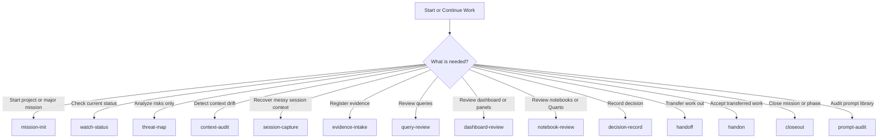

# Command Prompts

## Watch Role

Command Prompt Index.

This folder contains reusable AI operating prompts.

Use these prompts to make ChatGPT, Codex, Claude, Amazon Q, Qodo, GitHub Copilot, or other AI assistants follow the same project discipline across sessions.

## Purpose

Prompts in this folder are commands, not evidence.

They define how an AI session should behave when initializing a mission, checking status, mapping threats, detecting drift, capturing session signal, registering evidence, reviewing queries, inspecting dashboards, reviewing notebooks, recording decisions, transferring work, accepting work, closing missions, or auditing the prompt system itself.

Do not store project findings, raw logs, query results, evidence, or investigation conclusions in this folder.

## Prompt Files

| Prompt | Watch Role | Purpose | Default Authority |
|---|---|---|---|
| `mission-init.prompt.md` | Establish the Watch | Establish or refresh the Watch baseline and initialize or update selected `01_context/` files when strong durable context is supplied. | Edits `CURRENT_MISSION.md`, `PROJECT_STATE.md`, `AI_CONTEXT.md`, and selected `01_context/` files during initialization only |
| `watch-status.prompt.md` | Warden Status | Inspect current operational status. | Read-only |
| `threat-map.prompt.md` | Threat Mapping | Analyze risks and blind spots without recommendations. | Read-only |
| `context-audit.prompt.md` | Drift Sweep | Detect contradictions, stale context, and contamination risk. | Read-only |
| `session-capture.prompt.md` | Signal Capture | Extract useful context from messy chats or sessions. | Read-only; proposes destinations |
| `evidence-intake.prompt.md` | Evidence Intake | Register and classify evidence. | Edits `02_evidence/EVIDENCE_INDEX.md`, `02_evidence/DEPRECATED_EVIDENCE.md` only |
| `query-review.prompt.md` | Query Review | Review, classify, and register queries. | Edits `03_queries/QUERY_REGISTRY.md` only |
| `dashboard-review.prompt.md` | Observatory Review | Review dashboards, panels, visualizations, and monitoring surfaces. | Read-only |
| `notebook-review.prompt.md` | Field Lab Review | Review Jupyter and Quarto work. | Edits `04_notebooks/NOTEBOOK_INDEX.md`, `06_outputs/OUTPUT_INDEX.md` only |
| `decision-record.prompt.md` | Command Ruling | Record tactical or strategic decisions. | Edits `00_control/DECISION_LOG.md`, `07_decisions/ARCHITECTURE_DECISIONS.md` only |
| `handoff.prompt.md` | Relay Out | Create or refresh outgoing handoff. | Edits `AI_HANDOFF.md` only; proposes `TOOL_NOTES.md` updates only |
| `handon.prompt.md` | Relay Acceptance | Accept, reject, block, or flag incoming handoff. | Read-only |
| `closeout.prompt.md` | Close the Watch | Close a mission or phase. | Edits `PROJECT_STATE.md`, `AI_HANDOFF.md`, `00_control/WORK_LOG.md`, `09_archive/` |
| `prompt-audit.prompt.md` | Command Inspection | Audit prompt files for clarity, redundancy, and drift. | Read-only by default; edits only after explicit human approval naming exact files |

## Command Cycle



## Relay Patterns

### Session transfer: mission continues

```text
handoff -> handon
```

Use this when one chat, tool, machine, or session stops and another continues the same mission.

### Mission or phase ends with no continuation

```text
closeout
```

Use this when the mission or phase is complete and there is no active next relay.

### Phase closes but work continues elsewhere

```text
closeout -> handoff -> handon
```

Use this when one phase closes but another session, tool, or phase must continue from the result.

## Command Boundaries

Each prompt has a narrow Watch duty.

Do not use one prompt to perform another prompt’s role.

Examples:

```text
mission-init establishes the Watch.
evidence-intake registers proof.
query-review classifies query logic.
dashboard-review inspects the Observatory.
notebook-review inspects the Field Lab.
handoff packages outgoing work.
handon accepts incoming work.
closeout closes a mission or phase.
```

For dashboard review, panel review, or observability-surface analysis, provide:

```text
02_evidence/EVIDENCE_INDEX.md
02_evidence/DEPRECATED_EVIDENCE.md
03_queries/QUERY_REGISTRY.md
04_notebooks/NOTEBOOK_INDEX.md
05_reports/README.md
05_reports/REPORT_INDEX.md
PROJECT_STATE.md
AI_CONTEXT.md
```

For notebook review, Quarto review, notebook cleanup, or reproducibility work, provide:

```text
04_notebooks/README.md
04_notebooks/NOTEBOOK_INDEX.md
```

For report drafting, report review, report cleanup, or report publication work, provide:

```text
05_reports/README.md
05_reports/REPORT_INDEX.md
```

For output review, output cleanup, output validation, or output publication work, provide:

```text
06_outputs/README.md
06_outputs/OUTPUT_INDEX.md
```

For strategic decision review, architecture decision work, or decision cleanup, provide:

```text
00_control/DECISION_LOG.md
07_decisions/README.md
07_decisions/ARCHITECTURE_DECISIONS.md
```

For scratch cleanup, experiment staging, or temporary workbench review, provide:

```text
08_workbench/README.md
```

For archive review, closure bundling, or retired-material cleanup, provide:

```text
09_archive/README.md
```

For automation review, helper-script cleanup, or utility organization, provide:

```text
10_automation/README.md
```

## How to Use a Prompt

1. Open the prompt file.
2. Copy the prompt into the AI tool or chat window.
3. Provide the requested project files or context.
4. Let the AI draft proposed updates or diagnostics.
5. Review the draft.
6. Apply changes only after confirmation.

If a prompt detects durable domain, vocabulary, system, topology, or external-reference context, route it into:

```text
Proposed Follow-Up File Updates
```

unless that prompt already has explicit authority to update the correct destination file.

## Standard Watch Discipline

Every prompt should force the AI tool to separate:

- user-provided facts
- evidence-backed facts
- assumptions
- blind spots
- open questions
- proposed file updates

When applicable, prompts should also distinguish between:

- direct file updates allowed by current prompt authority
- follow-up context updates that require later human-approved changes to `01_context/`

## Controlled File Rule

The following files are controlled:

```text
CURRENT_MISSION.md
PROJECT_STATE.md
AI_CONTEXT.md
AI_HANDOFF.md
TOOL_NOTES.md
```

AI tools may edit or rewrite controlled files only when explicitly instructed and only within the authority of the prompt being used.

If a prompt produces updates for controlled files, review them before accepting the changes.

## Prompt Safety Rules

Do not ask an AI tool to infer missing evidence.

Do not let a prompt overwrite validated truth without review.

Do not let old chat memory override project files.

Do not treat generated output as verified until it is reviewed and recorded in the correct project file.

Do not store secrets, credentials, tokens, API keys, certificates, private keys, or restricted company data in prompt files.

Do not store project-specific findings in reusable prompt files.

## Prompt Maintenance

Use:

```text
prompt-audit.prompt.md
```

when prompt files become unclear, redundant, stale, too project-specific, or inconsistent with the current template doctrine.

`prompt-audit.prompt.md` is read-only by default.

It may edit prompt files only after explicit human approval naming the exact files allowed for modification.

## Last Updated

Local time: `[YYYY-MM-DD HH:MM timezone]`

Updated by: `[Human/ChatGPT/Codex/etc.]`
